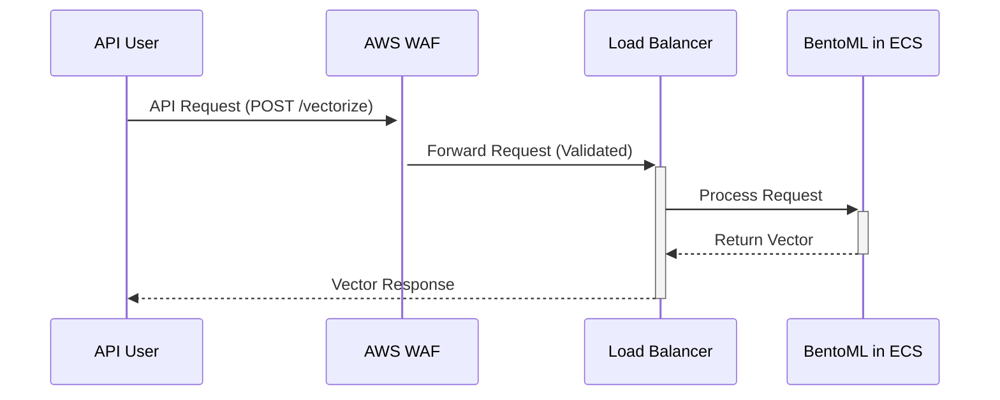

# terraform_aws_ecs_bentoml

Deploy BentoML to ECS on AWS using Terraform to create vectors quickly and easily.

## Overview
This project sets up the necessary AWS infrastructure to run BentoML on ECS. It allows users to easily integrate their own domain with the provided load balancer endpoint, simplifying API calls for vectorization tasks.

## Features
- **AWS ECS Deployment**: Runs BentoML as a service on ECS.
- **Secure API Access**: API traffic is protected by AWS WAF, attached to the load balancer.
- **Pre-Built Model**: Leverages the model hosted in this repository: [CLIP Vectorization BentoML](https://github.com/gordonmurray/CLIP_vectorization_bentoML).

## Getting Started
### Accessing the API
Once Terraform completes, it outputs the load balancer address. You can use this address to call the BentoML API.

### Example Request
Make sure to include the correct headers to avoid being blocked by AWS WAF:

```bash
curl -X POST \
  -H "Content-Type: image/jpeg" \
  -H "User-Agent: my-custom-agent/1.0" \
  --data-binary @image.jpg \
  http://{load_balancer_address}/vectorize
```

Replace `{load_balancer_address}` with the actual address from Terraform outputs.


### Diagram (Mermaid)




## Cost Estimate (Infracost)
Here’s a breakdown of the estimated costs for running the project:

```
──────────────────────────────────
57 cloud resources were detected:
∙ 10 were estimated
∙ 46 were free
∙ 1 is not supported yet, rerun with --show-skipped to see details

┏━━━━━━━━━━━━━━━━━━━━━━━━━━━━━━━━━━━━━━━━━━━━━━━━━━━━┳━━━━━━━━━━━━━━━┳━━━━━━━━━━━━━┳━━━━━━━━━━━━┓
┃ Project                                            ┃ Baseline cost ┃ Usage cost* ┃ Total cost ┃
┣━━━━━━━━━━━━━━━━━━━━━━━━━━━━━━━━━━━━━━━━━━━━━━━━━━━━╋━━━━━━━━━━━━━━━╋━━━━━━━━━━━━━╋━━━━━━━━━━━━┫
┃ main                                               ┃          $133 ┃           - ┃       $133 ┃
┗━━━━━━━━━━━━━━━━━━━━━━━━━━━━━━━━━━━━━━━━━━━━━━━━━━━━┻━━━━━━━━━━━━━━━┻━━━━━━━━━━━━━┻━━━━━━━━━━━━┛
```

## Security Check (TFSec)
The project underwent a security review using TFSec. Below are the results:

```
  results
  ──────────────────────────────────────────
  passed               35
  ignored              0
  critical             4
  high                 1
  medium               0
  low                  1

  35 passed, 6 potential problem(s) detected.
```

### Addressing Security Issues
Review the critical and high issues flagged by TFSec and update the Terraform configuration as needed to enhance security.

---
Feel free to contribute improvements or submit issues in the repository.

